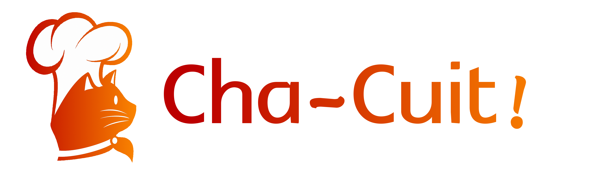
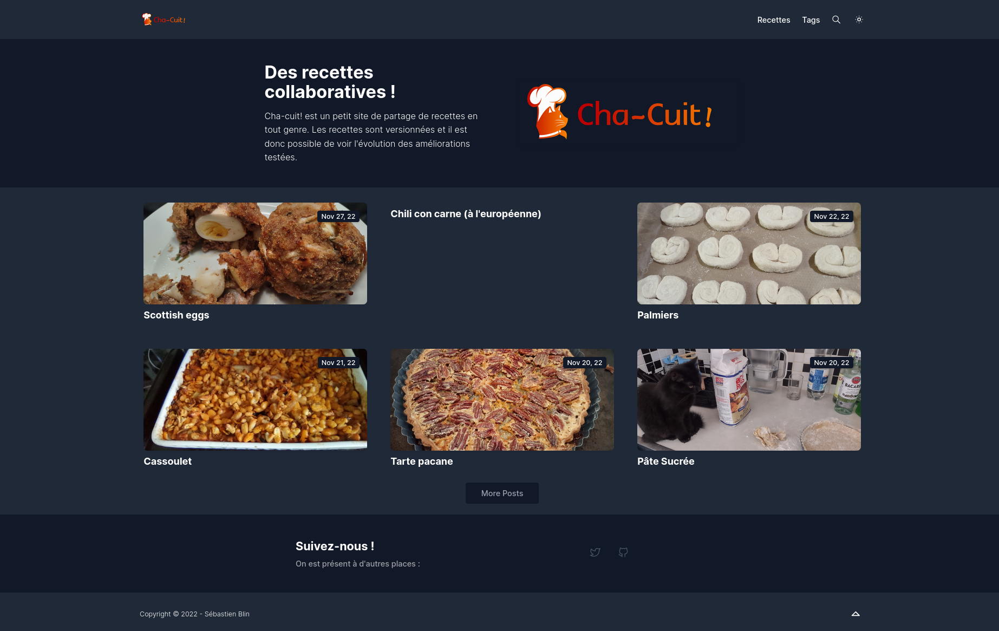

# Cha-Cuit!



Is a cooking website capable of interacting with other instances via the ActivityPub protocol.



## Build instructions

### Dependencies

This website is composed of a static front-end made with [hugo](https://gohugo.io/installation/linux/) and
an ActivityPub server (located in `/chactivity`).

Then, you will need NGINX and `certbot` (or any other application that can generated certificates for your website).

Finally, for the Blist theme, you will need postcss (`npm install postcss-cli`).

### Configuring the instance

For the backend cf [chactivityserver](/chactivityserver/README.md).
For the front-end, you can edit [config.toml](/config.toml)

Hugo supports multiple themes and images can be modified in `/static`.

### Updating website

On the main instance, I only use a cronjob updating the website every 3 hours:
`1 */3 * * * cd /var/www/Cha-Cuit && git pull && git submodule update --init && hugo`

## Writing recipes

Recipes are stored in a markdown file (cf `content/recettes`).

Images linked to the articles are in `/static/img/recipe-name`.

The recommended template is:

```md
---
title: Name of the Recipe
date: 2023-01-01
tags: ["sugar", "chocolate"]
duration: 1h30
thumbnail: "/img/recipe/recipe.jpg"
---

# Ingredients

# Equipment

||

# Preparation

# Notes
```

`||` is used as a column separator. This allow the website to display the recipe on two columns.


## Contribute

Please, feel free to contribute to this project in submitting patches, corrections, opening issues, etc.

For more infos and ideas read [CONTRIBUTING.md](/CONTRIBUTING.md) and [CODE_OF_CONDUCT.md](/CODE_OF_CONDUCT.md).