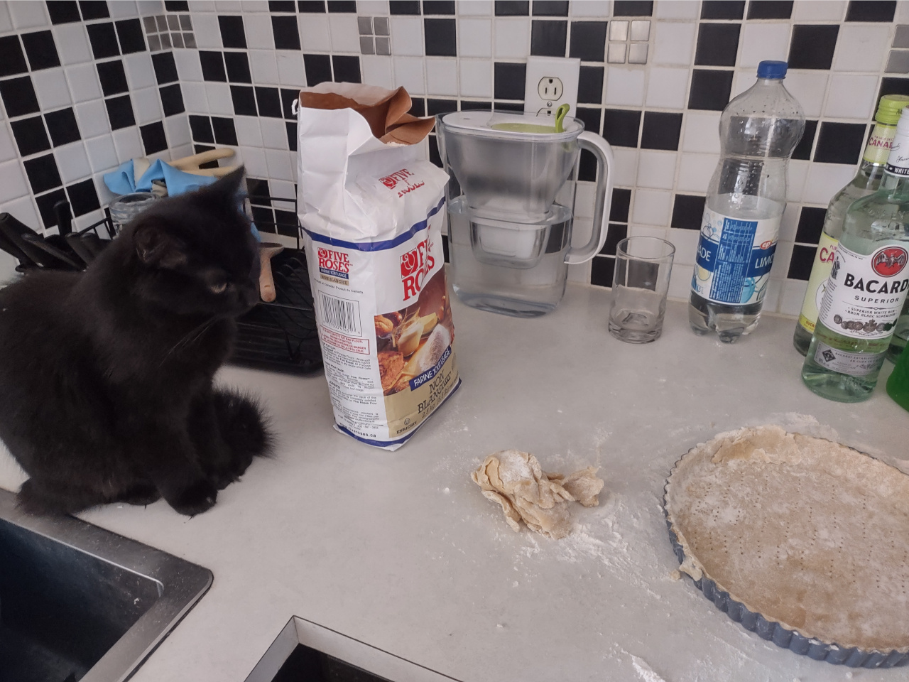

# Ingrédients

+ 80g Beurre salé
+ 90g sucre glace
+ 210g farine
+ 1 pincée de sel
+ 1 œuf
+ 1/2 c. café. d'extrait de vanille

# Équipement

+ Four
+ Rouleau à pâtisserie
+ 1 moule à tarte
+ Billes de porcelaine (ou pois chiches)
+ 1 fouet

# Préparation

1. Laisser ramolir le beurre et battre l'œuf puis mélanger tous les ingrédients pour former une boule.
2. Laisser une heure au frigo
3. Abaisser la pâte et la mettre dans le moule. Piquer à la fourchette et mettre les billes.
4. Cuire 20 min à 180°C avec les billes, puis 15 min sans.

# Notes

Faire reposer 30 min avant utilisation.